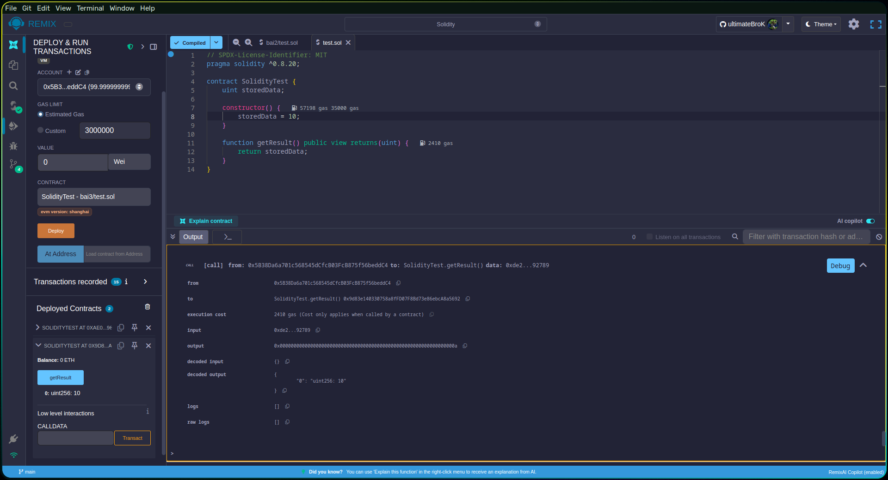
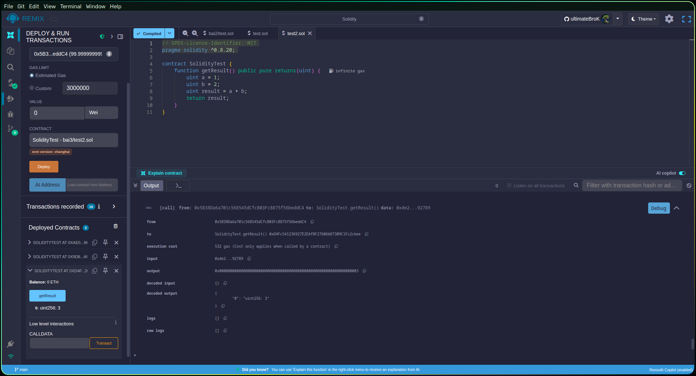

# Bài 3. Sử dụng biến

**Thử chạy đoạn code sau (tự sửa lỗi nếu có):**

```solidity
pragma solidity ^0.5.0;

contract SolidityTest {
    uint storedData;

    constructor() public {
        storedData = 10;
    }

    function getResult() public view returns(uint) {
        uint a = 1;
        uint b = 2;
        uint result = a + b;
        return storedData;
    }
}
```

## Sửa chữa

Vấn đề: Hàm `getResult` tính `a + b` nhưng trả `storedData` thay vì `result`. 

Có 2 hướng giải quyết:

1) Trả về kết quả cộng → trả result

```solidity
// SPDX-License-Identifier: MIT
pragma solidity ^0.8.20;

contract SolidityTest {
    function getResult() public pure returns(uint) {
        uint a = 1;
        uint b = 2;
        uint result = a + b;
        return result;
    }
}
```

2) Trả về số trong hộp → giữ storedData

```solidity
// SPDX-License-Identifier: MIT
pragma solidity ^0.8.20;

contract SolidityTest {
    uint storedData;

    constructor() {
        storedData = 10;
    }

    function getResult() public view returns(uint) {
        return storedData;
    }
}
```

## Kết quả

### 1) Trả về kết quả cộng → trả result



---

### 2) Trả về số trong hộp → giữ storedData


