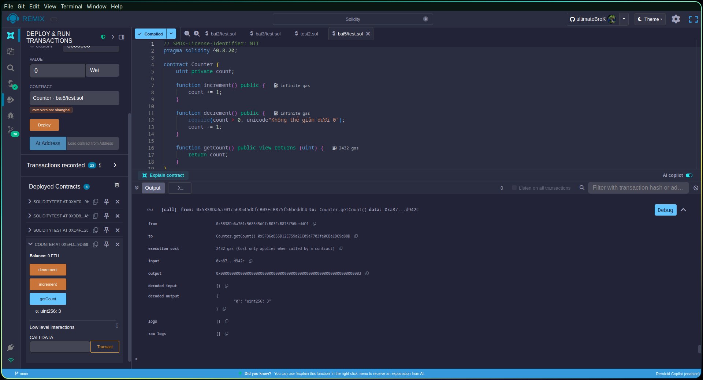
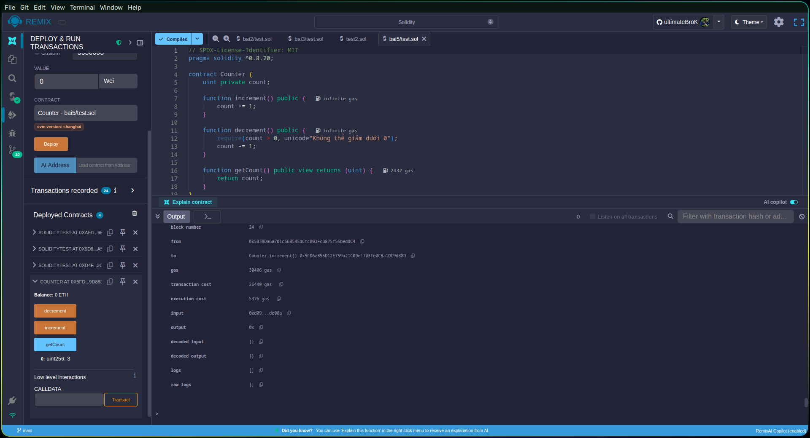
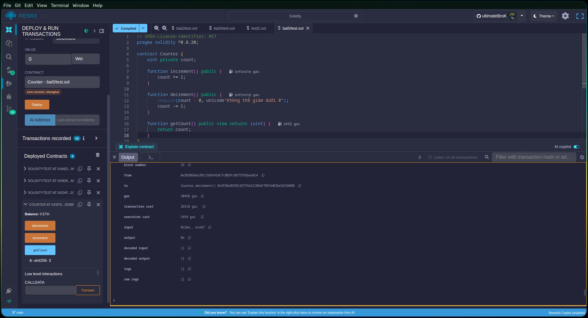

# Bài 5. Contract đơn giản nhất

Viết một smart contract tên là Counter với các yêu cầu sau:
- Có một biến trạng thái count kiểu số nguyên không âm
- Có hàm increment() để tăng count lên 1
- Có hàm decrement() để giảm count đi 1
- Có hàm getCount() để trả về giá trị hiện tại của count

## Kết quả

### Lấy giá trị đếm
  

---

### Tăng

---

### Giảm

