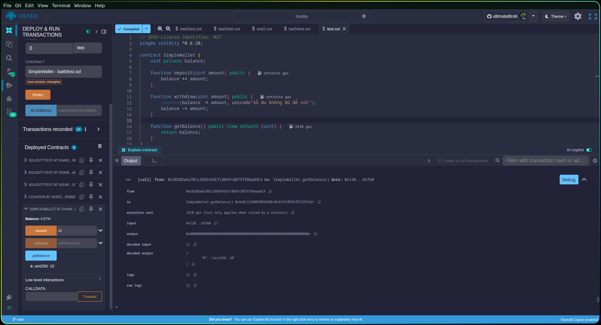
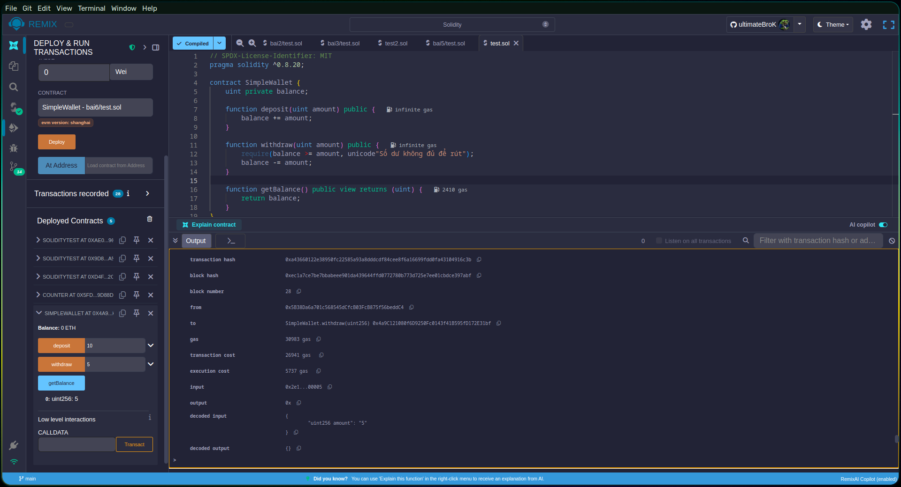

# Bài 6. Contract làm việc với ví

Viết một smart contract tên là SimpleWallet với các yêu cầu:
- Có biến trạng thái balance
- Có hàm deposit(uint amount) để tăng số dư
- Có hàm withdraw(uint amount) để giảm số dư
- Không cho phép rút nhiều hơn số dư hiện có
- Có hàm getBalance() để xem số dư

## Kết quả

### Gửi tiền
  

---

### Thông tin số dư

---

### Rút tiền

